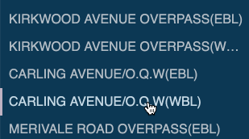

# Bridge Vue

This week we'll build a small Vue web app using a data API, Vue components, third-party libraries, and the [Vue CLI](https://cli.vuejs.org/).

The data we'll use is based on a freely available government dataset of [bridges in the province of Ontario](https://www.ontario.ca/data/bridge-conditions).  We'll
use this data under the [Open Government Licence - Ontario](https://www.ontario.ca/page/open-government-licence-ontario).

Our goal will be to create an app that lets us explore the data set visually, like the following:


## Project Data

Before we look at code, let's begin with our data.  In fact, beginning with our data
is a key part of what we'll do.  Creating modern web frontends often starts with data,
and uses that to direct our UI and code decisions.  For this app, we'll be
using a simple JSON API endpoint:

https://api.myjson.com/bins/17fpo0

This API allows us to `GET` a processed version of the [bridge dataset](https://www.ontario.ca/data/bridge-conditions) as JSON.  We're using the http://myjson.com/
service to host our data for free as a [CORS enabled API](http://myjson.com/api).

You can view the data in a *pretty* format at https://api.myjson.com/bins/17fpo0?pretty=1.
Its an `Array` of `Object`s, each having the following format:

```json
{
  "id": 0,
  "name": "Highway 24 Underpass at Highway 403",
  "lat": 43.167233,
  "lng": -80.275567,
  "year": 1965,
  "length": 65,
  "width": 25.4
}
```

Each bridge record has a `name`, geographic location (`lat` and `lng`), the
`year` it was built, and its dimensions (`length` and `width`).

We'll write code to *use* this API, process the data a bit so we can
work with it on the web, and then display it in interesting ways to our users.

## Project Creation with Vue CLI

For this example, we'll use the [Vue CLI](https://cli.vuejs.org/) to create our app.

> NOTE: this folder already contains a pre-created Vue app, using the steps below.
> You can use it, or make your own.  If you're using the pre-built version in this
> repo, you should install all dependencies using `npm install` and skip this section.

Install the Vue CLI using the [steps defined in the guide](https://cli.vuejs.org/guide/installation.html):

```
npm install -g @vue/cli
```

Now use the `vue create` command to [create a new Vue project](https://cli.vuejs.org/guide/creating-a-project.html):

```
vue create bridge-vue
```

You can use the **default** project settings when prompted:


This will create a `bridge-vue/` directory, with all necessary dependencies installed,
and a basic project created.  We can run the project using the following:

```
cd bridge-vue
npm run serve
```

We can leave the web server running while we write the rest of our code, and it
will automatically reload as we update our files.

## Vue Project Layout

Our `bridge-vue` project is broken up into the following files and directories:

```
/bridge-vue
    /public
        favicon.ico      <-- our project's icon
        index.html       <-- main html file
    /src
        assets/          <-- any static assets we need (e.g., images)
        components/      <-- our custom Vue components go here
        App.vue          <-- our application's main component
        main.js          <-- our project's entry point (main JavaScript file)
```

We'll work through these files below, and add our own.

### `public/index.html`

Let's start with our main HTML page, which is simple: just enough
to host our Vue application and components.  Our Vue app (i.e., `App.vue`) will get
*mounted* in the `<div id="app"></div>` element.  Notice too that this `<div>` is itself
contained with a `<main></main>` element, which we'll use to create our layout below.

```html
<!DOCTYPE html>
<html lang="en">
  <head>
    <meta charset="utf-8">
    <meta http-equiv="X-UA-Compatible" content="IE=edge">
    <meta name="viewport" content="width=device-width,initial-scale=1.0">

    <link rel="icon" href="<%= BASE_URL %>favicon.ico">
    <title>Ontario Bridges</title>
  </head>
  <body>
    <main>
        <div id="app"></div>
        <!-- built files will be auto injected -->
    </main>
  </body>
</html>
```

One notable thing here is the use of `<%= BASE_URL %>` for the favicon path.  This project
uses [webpack](https://webpack.js.org/) to build and bundle our code.  The
use of `<%= BASE_URL %>` tells webpack to substitute the value of `BASE_URL`
when building.  You can [read more about why we use this here](https://cli.vuejs.org/guide/html-and-static-assets.html).

Finally, notice how there is no JavaScript here at all.  When webpack builds our
code, it will inject it automatically for us.

### `src/main.js`

Next we look at our application's main entry point, `src/main.js`:

```js
import Vue from 'vue';
import App from './App.vue';

Vue.config.productionTip = false;

const vm = new Vue({
  render: h => h(App),
}).$mount('#app');
```

Our project `import`s both `Vue` and our main `App.vue` component.  The third
line gives a hint to Vue that we are going to be working in development mode,
and [don't need production warnings](https://vuejs.org/v2/guide/deployment.html).

Next we create an instance of our Vue view-model.  The format is slightly different
from what we've done in the past.  Instead of defining a `template` to use, this
uses a so-called `render` function.  The name [`h` is shorthand
for `createElement`](https://vuejs.org/v2/guide/render-function.html#The-Virtual-DOM),
and Vue gives us a function to use which can create our component.  You can
read a [good discussion of this here](https://css-tricks.com/what-does-the-h-stand-for-in-vues-render-method/).

Vue takes the *virtual node* created by `h()` for our `App` and calls [`$mount()`](https://vuejs.org/v2/api/#vm-mount)
on it, to place it into the DOM, in this case using the element with `id="app"`.

### `src/App.vue`

The bulk of our Vue code begins in `App.vue`.  Here we define the top-level
layout of our application, and its main logic.  We could put everything here; that is,
we could include all JS, CSS, and HTML for all aspects of our page in this one file.
However, we'll break it up (decompose it) into a set of components, each of which
will manage different parts of the page.  Our goal will be to keep each part
simple, and create a larger app out of understandable, smaller pieces.

Here's what `src/App.vue` looks like at first:

```html
<template>
  <div id="app">

    <nav id="menu">
      Menu goes here...
    </nav>

    <div id="bridge-info">
      Bridge info goes here...
    </div>

  </div>
</template>

<script>
export default {
  name: "App",
  data: function() {
    return {
    };
  }
};
</script>

<style>
/* All CSS for this component will go here */
</style>
```

Our `template` defines the top-level UI to be a main container (`#app`) with
two children: a `#menu` and some `#bridge-info`.

Our `script` exports an `Object` for our component, which includes its `name`,
as well as `data`.  Because this is a component, and it's possible for there
to be more than one instance of a component, we use a `function` to return
our `data` vs. an `Object`.  Each instance of a component can then have its
own `data`.

We don't have any CSS in the `style` block yet, so let's add that now.

#### App CSS Style

Let's begin with our UI's layout and general styles.  We need our Vue app
to fill the window (i.e., 100% `width` and `height`, no `margin`).  We also
need to divide the window into thirds: one-third for the left-hand menu, two-thirds
for the bridge info pane on the right.

We'll start with the top-level elements:

```css
html,
body,
main {
  height: 100%;
  max-height: 100%;
  margin: 0;
  font-family: Helvetica, Arial, sans-serif;
}
```

Now our `html`, `body`, and `main` elements all use 100% of the window's `height`,
but no more than that (i.e., `max-height` is also 100%).  By default they will
all use 100% of the `width` automatically (i.e., we could include `width: 100%`
but it's not necessary).  We've also added a `font-family` to improve the look
of our text.

Next we need to stretch our `#app` container `div` to fill the entire window.
There are various ways to do this in CSS, but we'll use [Flexbox](https://developer.mozilla.org/en-US/docs/Learn/CSS/CSS_layout/Flexbox) in this app. With
Flexbox we can stretch (or shrink) child contents evenly in a parent container.
If you're new to Flexbox, [this guide is also really well done](https://css-tricks.com/snippets/css/a-guide-to-flexbox/).

To use Flexbox, we specify `display: flex` on a parent container.  This tells
the browser to use Flexbox when laying out the container's child elements.
Flexbox allows us to specify the [`flex-direction`](https://developer.mozilla.org/en-US/docs/Web/CSS/flex-direction) to use, which will affect how items are placed in the container.
By default this will be `row` (i.e., left to right), but we can also specify
`column` (i.e., a top to bottom layout).

Using these techniques, we can combine Flexbox on a number of containers to
achieve our desired layout.  We can nest elements, and use Flexbox differently
at each level, producing complex layouts.

On large screens, our `main` element will *flex* from
top to bottom, and our `#app` will *flex* from left to right (`row`).  When the available
screen size shrinks below `400px` (e.g., mobile), we'll use a [media query](https://developer.mozilla.org/en-US/docs/Web/CSS/Media_Queries/Using_media_queries) to stack our layout
(i.e., use top-down `column` vs. left-to-right `row`).  In both cases, we don't want our `#app`
to scroll, so we'll set [`overflow: hidden`](https://developer.mozilla.org/en-US/docs/Web/CSS/overflow):

```css
main {
  display: flex;
  flex-direction: column;
}

#app {
  height: 100%;
  display: flex;
  flex-direction: row;
  overflow: hidden;
}

@media screen and (max-width: 400px) {
  #app {
    flex-direction: column;
  }
}
```

Last, we need to divide our `#app` into a two column layout, with the `#menu`
taking one-third of the space, and the rest (two-thirds) for the `#bridge-info`.
We won't specify an exact width, but let the browser figure it out.  To do this,
we'll specify that we have 3 units total in our `#app` flex container: 1 unit
for the `#menu`, and 2 units for the `#bridge-info`. Because our menu will be
really long vertically, we'll tell the browser to add scrollbars as
necessary with [`overflow: auto`](https://developer.mozilla.org/en-US/docs/Web/CSS/overflow):

```css
#menu {
  flex: 1;
  overflow: auto;
}

#bridge-info {
  flex: 2;
}
```

When finished, the `App.vue` final `<style>` block will look like this:

```html
<style>
html,
body,
main {
  height: 100%;
  max-height: 100%;
  font-family: Helvetica, Arial, sans-serif;
  margin: 0;
}

main {
  display: flex;
  flex-direction: column;
}

#app {
  height: 100%;
  display: flex;
  flex-direction: row;
  overflow: hidden;
}

#menu {
  flex: 1;
  overflow: auto;
}

#bridge-info {
  flex: 2;
}

@media screen and (max-width: 400px) {
  #app {
    flex-direction: column;
  }
}
</style>
```

### `src/bridges.js`

Next let's get our bridge data loaded from the myjson.com REST API.
In order to keep our `App.vue` component from getting really long, we'll break
this code out into its own file. Throughout this application, we're going to try
and separate different parts of our code into their own files, components, classes, etc.

Create `src/bridges.js` and let's use the new [`fetch()`](https://developers.google.com/web/updates/2015/03/introduction-to-fetch) browser API.  Our code will do the following:

- do an HTTP `GET` request to our API
- check the response we get back to make sure it worked (`200 ok`)
- if it failed, throw an error
- if it worked, parse the response JSON into JS Objects
- fix-up all the bridge names so they can be displayed in HTML properly

Here's the code:

```js
// Convert characters like ' to HTML entities using
// https://github.com/mathiasbynens/he#heencodetext-options
import { encode } from 'he';

const bridgeUrl = 'https://api.myjson.com/bins/17fpo0';

export default function() {
  // Return a Promise
  return fetch(bridgeUrl)
    .then(response => {
      // If we don't get a 200 OK response, throw an error to the .catch()
      if (!response.ok) {
        throw new Error(response.statusText);
      }

      // Parse the response body from JSON to JS (an Array) 
      return response.json();
    })
    .then(bridges => {
      // Encode and normalize (uppercase) all bridge names
      bridges.forEach(bridge => {
        // Bridge name in uppercase, not encoded
        bridge.name = bridge.name.toUpperCase();
        // Bridge name uppercase and encoded (HTML entities suitable for web display)
        bridge.nameEncoded = encode(bridge.name)
      });

      return bridges;
    });
    // NOTE: we aren't going to deal with errors here, caller must .catch()
}
```

A few things to note here.  First, we `import` a single function `encode`, from the [`he` package](https://www.npmjs.com/package/he).  The `he` package provides code to encode
text into [HTML Entities](https://html.spec.whatwg.org/multipage/named-characters.html#named-character-references) so that they can be displayed
on the web.  To use this package, we need to install it into our `node_modules`:

```
npm install --save he
```

Then we can use the [`encode`](https://www.npmjs.com/package/he#heencodetext-options) function to parse a `String` with invalid characters, and get back an encoded
version.  Our bridge data contains lots of special characters, and we can
use `encode` to do something like this:

```js
import { encode } from 'he';

const name = "HWY #401 O'PASS/RAMP W-N EB COL";
const encodedName = encode(name);
// encodedName --> "HWY #401 O&#x27;PASS/RAMP W-N EB COL"
```

Next, we `export` a `default function` (i.e., there's only one, and we won't
name it).  This function returns a [`Promise`](https://developer.mozilla.org/en-US/docs/Web/JavaScript/Reference/Global_Objects/Promise), which callers can use to get
the resulting value, and process any errors.  We also use this promise to
pre-process the data we get back from our API.

We start with a `GET` request to our Bridge API URL.  When the `response` comes
back, we check if it's `ok` or not.  If it fails, we `throw` an Error with an error
message.  Our caller can figure out what to do with this error (i.e, we don't care
about the UI here).  If the response is `ok`, we parse the body from JSON into
an `Array`, and `then` process each item in that `bridges` `Array` to fix
the `name`: capitalize and encode.  When we're done, we `return` the `bridges`
to our caller, so they can display it.

### Menu Components

Now that we have code to load our bridge data, let's shift gears and focus
on building some components to render this data to the user.  We'll create
two Vue components to manage our sidebar menu of bridge items:

1. `BridgeMenu` will be the entire menu
1. `MenuItem` will be a single item in our menu

Create two new files: `src/components/BridgeMenu.vue` and `src/components/MenuItem.vue`.
Let's write the code for the `MenuItem` component first.



#### `src/components/MenuItem.vue`

Our `MenuItem` component is a nice one to start with, because it's so simple.
We'll work our way toward more complex components, but starting small is a good
way to get comfortable with Vue's component model and patterns.

Each of our `MenuItem`s is just a `<div>` with some special styling, and
event/state management.  Here's the HTML `template` portion:

```html
<template>
  <div
    :title="bridge.name"
    @click="handleClick"
    v-html="bridge.nameEncoded">
  </div>
</template>
```

We define our `<div>` and specify three directives:

1. `:title="bridge.name"`, which will bind ([`v-bind`](https://v1.vuejs.org/guide/syntax.html#v-bind-Shorthand)) the bridge's name to the [`title`](https://developer.mozilla.org/en-US/docs/Web/HTML/Global_attributes/title).  If the `bridge` changes, so will the `<div>`'s `title`.
1. `@click="handleClick"`, which will register an event listener named `handleClick` for the `click` event ([`v-on:click`](https://vuejs.org/v2/guide/events.html#Methods-in-Inline-Handlers)).  When the user clicks on one of these `<div>` elements, it will trigger `handleClick` in our code below.
1. `v-html="bridge.nameEncoded"`, which will [render raw, HTML-formatted text](https://vuejs.org/v2/guide/syntax.html#Raw-HTML) in our `<div>`'s content.  We could have used `{{ bridge.nameEncoded }}`, but this would ignore out HTML entities and use pure text.  We've already created encoded HTML text for each bridge name, so let's use that.

Next let's add some styles for our `MenuItem`'s `<div>`:

```html
<style scoped>
div {
  background-color: #0b3954;
  color: #b5bec6;
  padding: 8px;
  /* Change the mouse cursor so the user knows you can click this element */
  cursor: pointer;
  /* Place a transparent border on all elements, so they don't change width on hover */
  border-left: 3px solid transparent;

  /* Instead of wrapping or cropping, show ... if the name is too long */
  overflow: hidden;
  text-overflow: ellipsis;
  white-space: nowrap;
}

div:hover {
  color: #C7DBE6;
  border-left: 3px solid #bfb1c1;
}
</style>
```

Here we're using [`scoped` CSS](https://vue-loader.vuejs.org/guide/scoped-css.html) so
we don't have to define any classes, and can target the component's `<div>` directly, without it
affecting other `<div>` elements in our page.

We apply some colours, change the [`cursor`](https://developer.mozilla.org/en-US/docs/Web/CSS/cursor) so it's clear to users that you can *point* at this
menu item, and deal with really long names by using `...` and hiding extra characters
that won't fit in the given width.

We also change the look when the user hovers their mouse.  Notice that we're adding a left border
to all elements, but making them [`transparent'](https://developer.mozilla.org/en-US/docs/Web/CSS/color_value#transparent_keyword) until you hover.  If we didn't do this,
when we add the left border, it would shift the text, since the parent element's size
would suddenly change.  This trick keeps things aligned.

Finally, let's include our JS code:

```html
<script>
export default {
  name: 'MenuItem',
  props: ['bridge'],
  methods: {
    handleClick: function() {
      // Pass a `click` event up to the parent, along with the chosen bridge
      this.$emit('click', this.bridge);
    }
  }
}
</script>
```

Our `MenuItem` is pretty basic.  It `export`s an `Object` that defines a `name`, and accepts a [`prop`](https://vuejs.org/v2/guide/components-props.html) from its parent, in this case a `bridge` `Object`. We use a `prop` here vs. `data` because we won't define this value; rather, we'll simply *use* it and another part of our app can define and pass it to us.

We should mention what's happening with [`methods`](https://v1.vuejs.org/guide/events.html),
and how we use it to define our event listener.  We're defining a `method` (i.e., a `function`) for our component, `handleClick`.  This is the function that we want to get
called when the user clicks on our `<div>`.  Recall that we added an inline event
handler in our template above: `@click="handleClick"`.  When the user clicks on the
DOM element, we want to [`emit` a custom event](https://vuejs.org/v2/guide/components-custom-events.html) named `'click'` (we could have called it anything).
However, our `MenuItem`'s `click` event will be higher-level than a DOM `click`
event, in that we'll also include the `bridge` that this `MenuItem` represents.

Basically, we're *wrapping* a DOM event with our own custom event, which other
Vue components in our app can consume.  Instead of just saying, "a `<div>` was
clicked," our `MenuItem` is really saying, "a `bridge` was clicked."  It's a small
difference, but it will let us write more abstract code in other components, without
worrying about the DOM.

#### `src/components/BridgeMenu.vue`

Having defined a component for each bridge menu item, let's next create the
parent component to manage them all: `BridgeMenu.vue`.  Create a new file,
`src/components/BridgeMenu.vue`.  Here's the template:

```html
<template>
  <div id="menu">
    <div v-if="status.errored">
      <!-- We could do a better job with this error, just something to start... -->
      <p>Error: unable to load bridge data</p>
    </div>
    <div v-else>
      <div v-if="status.loading">Loading...</div>
      <div v-else>
        <!-- use our MenuItem component, using HTML style kebab-case -->
        <menu-item
          v-for="bridge of bridges"
          :key="bridge.id"
          :bridge="bridge"
          @click="bridgeSelected"
        />
      </div>
    </div>
  </div>
</template>
```

Our `BridgeMenu` component, like all Vue components, has a single root element,
`<div id="menu"></div>`.  Within this we're using a combination of nested
directives (`v-if`, `v-else`) to [conditionally render portions](https://vuejs.org/v2/guide/conditional.html) of our template.  For example, if there's an error while
loading our bridge data (`status.errored`), we want to show some kind of error UI.
Otherwise, we show another `<div>`, but again, only part of it.  Either we
show a `Loading...` message (if `status.loading` is `true`), or we show our menu.

We're using [`v-for` and `:key` to loop through our data](https://vuejs.org/v2/guide/list.html) and create each `MenuItem`.  Notice that we've used [kebab-case in our HTML template](https://vuejs.org/v2/style-guide/#Component-name-casing-in-templates-strongly-recommended)
vs. PascalCase (i.e., `<menu-item>` vs. `MenuItem`).  Both refer to the same thing,
but in HTML we'll use `menu-item`.

Each of our `<menu-item>` elements also includes two more directives worth calling out:

1. `:bridge="bridge"`, which will bind (`v-bind`) a given `bridge` Object to this `<menu-item>`, passing it along as a `prop`.  Earlier we defined `bridge` as a `prop` on our `MenuItem.vue` component, and this is how we pass it from the parent to a child component.
1. `@click="bridgeSelected"`, which will register an event listener for the `click` event emitted by a `MenuItem` component.  This is the other side of the event (the consumer) that we defined in `MenuItem.vue`.

Our `BridgeMenu` component will manage creating and displaying the set of `MenuItems`,
including handling errors, and listen for `click` events on a particular item.

Now for some styles, which tell our container to fill the available `height`:

```html
<style scoped>
#menu {
  height: 100%;
}
</style>
```

The JavaScript for our `BridgeMenu` is where most of the interesting things happen.
Here we're going to connect the two pieces of code we've been working on so far:

```html
<script>
import MenuItem from './MenuItem.vue';
import getBridgeData from '../bridges.js';

export default {
  name: 'BridgeMenu',
  data: function() {
    return {
      status: {
        loading: false,
        errored: false
      },
      bridges: null
    }
  },
  components: {
    MenuItem
  },
  created: function() {
    this.loadBridges();
  },
  methods: {
    loadBridges: function() {
      this.status.loading = true;

      // Use our bridge.js function to talk to the REST API.
      getBridgeData()
        .then(bridges => {
          this.status.loading = false;
          this.bridges = bridges;
        })
        .catch(err => {
          console.error('Unable to load bridge data', err.message);
          this.status.errored = true;
        });
    },
    bridgeSelected: function(bridge) {
      // When the user clicks a menu item, emit a `change`
      // event for the menu control, along with bridge value
      this.$emit('change', bridge);
    }
  }
}
</script>
```

First, we `import` two of the files we made previously: our `bridges.js` file,
which will load our data; and `MenuItem.vue`, which will be used to render each
of the bridges in our menu.

Our component's `Object` includes a number of interesting things.  First,
notice that unlike our `MenuItem` component, the `BridgeMenu` does include
`data`.  As we did with `App.vue` above, we make this a `function` that returns
our `data` `Object`.  It includes some state on our network loading, and the
`bridges` `Array`, which starts off not existing (`null`).

Next we include the [list of `components`](https://vuejs.org/v2/guide/components-registration.html#Local-Registration) that we want to register and use
in this component.  Our `BridgeMenu` uses `MenuItem`, so we reflect that here.

Finally, we have some functions to define.  Our `methods` section includes `loadBridges`
and `bridgeSelected`.  The latter is another *wrapped* event handler: when a
`<menu-item>` has a `click` event, we'll receive it here, and then pass the
chosen `bridge` up to the parent of this component (i.e., our `App`).  We've
chosen to use a different name, `change`, to reflect that the menu's value has
changed.

Returning to `loadBridges`, we are calling our function from `bridges.js`
when our [component gets `created`](https://vuejs.org/v2/guide/instance.html#Instance-Lifecycle-Hooks).
This returns a `Promise`, which we're using here.  We've add a `.catch()` to deal with any errors.  We've also added some code to manage the `loading` state.
Both of these are used by our template to conditionally render parts of the UI.  If/when
the bridge data is fully loaded, we'll place it on our `data` Object, and let
our template re-render (i.e., build all the `<menu-item>` elements).

### Using the Menu Components

Now that our menu components are defined, let's use them in `App.vue`.  We need
to make a few tweaks to our `App.vue` template and code:

```html
<template>
  <div id="app">

    <nav id="menu">
      <!-- using the BridgeMenu.vue component here -->
      <bridge-menu @change="bridgeSelected" />
    </nav>

    <div id="bridge-info">
      <!-- just for development to see if things are working -->
      <p v-if="bridge" v-html="bridge.nameEncoded"></p>
      <p v-else>Bridge info goes here...</p>
    </div>

  </div>
</template>

<script>
import BridgeMenu from './components/BridgeMenu.vue';

export default {
  name: "App",
  data: function() {
    return {
      bridge: null
    };
  },
  components: {
    BridgeMenu
  },
  methods: {
    bridgeSelected: function(bridge) {
      this.bridge = bridge;
    }
  }
};
</script>
```

Only a few things need to change.  First, we've started using `<bridge-menu>`
in our template, and added an event listener `@change="bridgeSelected"`.  When
our `BridgeMenu` component emits a `change` event, we want to call `this.bridgeSelected`.

In our `script` we've also added a few things.  First, we've included an `import`
for our `BridgeMenu` component, and also registered it in `components: { BridgeMenu }`.
Second, we've updated our `data` to include some state about the currently selected
`bridge`.  We'll receive this info in our `bridgeSelected` event handler (defined
within `methods`), and then set our instance's `data` for `bridge` accordingly.
In this way our `App` can keep track of which `bridge` is currently selected.

For now, so we can see if things are working or not, let's add a simple
`v-if`/`v-else` to display the name of the selected `bridge` when it changes.
Our next task will be to create components to show information about the chosen
`bridge`.

### Bridge Info Components

Now that we've got a working menu for all our bridges, and a way for the user
to select one, let's write some components to visually *display* this bridge's info.
Recall the shape of our bridge data, as it exists in the `bridges` `Array`:

```js
{
  id: 0,
  name: "Highway 24 Underpass at Highway 403",
  nameEncoded: "Highway 24 Underpass at Highway 403",
  lat: 43.167233,
  lng: -80.275567,
  year: 1965,
  length: 65,
  width: 25.4
}
```

Because we've got geographic coordinates for every bridge, it would be nice to
show it on a map.  The rest of the data is pretty basic, and we can probably
just use text.  The only other interesting data point we could calculate and show
is the age of the bridge, since we know the `year` it was built.

Let's break our `#bridge-info` container into two parts:

1. a map, showing the location of the bridge and its name
1. an info panel of text, only shown when we choose a bridge

We'll create a `BridgeInfo.vue` component to manage all this.

#### `src/components/BridgeInfo.vue`

Create a new file, `src/components/BridgeInfo.vue`.  Here is the template:

```html
<template>
  <div id="bridge-info-wrapper">
    <div v-if="bridge" id="info-panel">
      <h2 v-html="bridge.name"></h2>

      <div class="bridge-stats">
        <div>Year: {{bridge.year}} ({{age}} years)</div>
        <div>Width: {{bridge.width}}m</div>
        <div>Length: {{bridge.length}}m</div>
      </div>
    </div>

    <!-- TODO
    <leaflet-map id="leaflet-map" :location="bridge" />
    -->
    <div id="leaflet-map">Map will goe here...</div>
  </div>
</template>
```

Our template has a root element, `#bridge-info-wrapper`, which is then
broken down into two parts: `#info-panel` and `#leaflet-map`.  The 
`<leaflet-map>` component doesn't exist yet, so let's just use a regular
`<div id="leaflet-map"></div>` for now, and do this next.

Let's add some styles:

```html
<style scoped>
#bridge-info-wrapper {
  display: flex;
  flex-direction: column;
  height: 100%;
}

#leaflet-map {
  flex: 5;
  height: 100%;
}

#info-panel {
  flex: 1;
  height: 100%;
  padding: .5em;

  background-color: #A6CC8B;
  color: #686950;
  border-bottom: solid 2px #686950;

  display: flex;
  flex-direction: column;
  justify-content: space-around;
  text-align: center;
}

#info-panel h2 {
  margin: .5em;
}

.bridge-stats {
  display: flex;
  flex-direction: row;
  justify-content: space-evenly;
  font-size: 1.3em;
}
</style>
```

Other than specifying colours and the like, the interesting parts of this include:

- `display: flex` and `flex-direction`: once again we are using flexbox to manage our layout.  The `#bridge-info-wrapper` *flexes* down (`column`), and splits the space between `#leaflet-map` (5/6) and `#info-panel` (1/6).
- `justify-content`: the `#info-panel` manages space around the `bridge` name and other info using flexbox, but instead of stretching all of the contents to fill the space, we're using `justify-content: space-around`, and the `.bridge-stats` does the same thing, only with `space-evenly`.  By letting the browser manage empty space, we can [create some complex layouts](https://css-tricks.com/almanac/properties/j/justify-content/).

Finally, our component's JS is quite simple:

```html
<script>
export default {
  name: 'BridgeInfo',
  props: ['bridge'],
  computed: {
    age: function() {
      return (new Date).getFullYear() - this.bridge.year;
    }
  }
}
</script>
```

We accept a `prop` named `bridge` (i.e, the chosen bridge), and also add
a `computed` value `age`: the number of years since this bridge was built.
Our template uses this to show the relevant info about our chosen bridge.

### Using BridgeInfo

Before we tackle the map, let's update `App` to use this new component
in its current form.  To do so, we need to make some changes in `App.vue`:

```html
<template>
  <div id="app">

    <nav id="menu">
      <!-- using the BridgeMenu.vue component here -->
      <bridge-menu @change="bridgeSelected" />
    </nav>

    <div id="bridge-info">
      <!-- using our BridgeInfo.vue component here -->
      <bridge-info :bridge="bridge" />
    </div>

  </div>
</template>

<script>
import BridgeMenu from './components/BridgeMenu.vue';
import BridgeInfo from './components/BridgeInfo.vue';

export default {
  name: "App",
  data: function() {
    return {
      bridge: null
    };
  },
  components: {
    BridgeMenu,
    BridgeInfo
  },
  methods: {
    bridgeSelected: function(bridge) {
      this.bridge = bridge;
    }
  }
};
</script>
```

In our template, we've started using `<bridge-info>`.  We're also using
`:bridge="bridge"` to bind (`v-bind`) the value in our `bridge` `data`
to the `prop` on our `BridgeInfo` component.  When it changes, the component
will re-render with the new data.

We've also updated our code.  We added an `import` for `'./components/BridgeInfo.vue'`,
and also added it to the list of registered `components`.

But that's it!  Everything should work now: select a bridge from the menu,
get the info panel showing for the bridge.

The only thing remaining is to add our map.

### Map Components: `src/components/LeafletMap.vue` and `src/simple-map.js`

To draw our map, we'll use the amazing (and free!) [Leaflet JavaScript library](https://leafletjs.com/).  Before we can use it, we need to add it as a dependency:

```
npm install --save leaflet
```

Now that we have Leaflet installed, we can start using it.  Doing so requires a
few things:

- include the Leaflet CSS file
- include the Leaflet JS file
- create an element in your page (e.g., `<div>`) to hold the map
- write some code using the Leaflet API to draw a map

Discussing all the [many, many features and APIs of Leaflet](https://leafletjs.com/reference-1.5.0.html) is beyond the scope
of this walkthrough.  It will be enough for us to use the main [Leaflet sample
code](https://leafletjs.com/examples/quick-start/) as an example:

```js
// Define some coordinates and a zoom level
const lat = 51.505;
const lng = -0.09;
const zoom = 13;

// Create a map in a #map div, at the given coordinates and zoom
const map = Leaflet.map('#map').setView([lat, lng], zoom);
// Load some map tiles from Open Street Maps (free) and add to our map
Leaflet.tileLayer('https://{s}.tile.openstreetmap.org/{z}/{x}/{y}.png').addTo(map);
// Create a popup with some text at the given coordinates and open over the map
const popup = Leaflet.popup()
  .setLatLng(Leaflet.latLng([lat, lng]))
  .setContent('Text for your Popup!')
  .openOn(map); 
```

#### `src/simple-map.js`

For our purposes, we need to be able to load the Leaflet library, create and manage
a map and popup, and update things when the user chooses different bridge locations.
Rather than making our map component really large, let's write a small, separate
JavaScript class to do all this in a new file, `src/simple-map.js`:

```js
import Leaflet from 'leaflet';

// General location/zoom to see all of Ontario
const ontario = {
  coords: [51.2538, -85.3232],
  zoom: 5
};

// By default, zoom the map to this level
const defaultZoom = 14;

// Create a class to manage our map and popup
class SimpleMap {
  constructor(el) {
    this.map = Leaflet.map(el);

    // Add the Open Street Maps tile layer (free)
    Leaflet
      .tileLayer('https://{s}.tile.openstreetmap.org/{z}/{x}/{y}.png')
      .addTo(this.map);
  
    // Show an initial map of Ontario zoomed out
    this.map.setView(ontario.coords, ontario.zoom);
  }

  // update method, takes a location info, and updates the map and popup based on it
  update(lat, lng, name) {
    // convert lat/lng to a Leaflet LatLng Object
    const coords = Leaflet.latLng(lat, lng);

    // Reposition the map to this location
    this.map.setView(coords, defaultZoom);

    // Update popup to the same position, with new name text
    if(this.popup) {
      // Update existing popup position and text
      this.popup.setLatLng(coords);
      this.popup.setContent(name);
    } else {
      // Create a popup if one doesn't exist
      this.popup = Leaflet
        .popup({
          // Don't let the user close this, we'll manage it
          closeButton: false,
          closeOnEscapeKey: false,
          closeOnClick: false
        })
        .setLatLng(coords)
        .setContent(name)
        .openOn(this.map);
    }
  }
}

// Export this class so others can use it
export default SimpleMap;
```

Our `src/simple-map.js` has an `import` for Leaflet, so we can use its API.
It then defines a class, `SimpleMap`, which manages `map` and `popup` instances.
Our `SimpleMap` class will hide the complexity of working with a map in Leaflet
from our `LeafletMap` component, which can instead focus on managing state
(i.e., chosen bridge location), and when to update the map.

In the `constructor` we take an element or selector (e.g., `'#map'`) and use that
to have Leaflet create a map that shows all of Ontario, zoomed out.  We also
load a set of map tiles.  [Leaflet supports many different map tile providers](https://leaflet-extras.github.io/leaflet-providers/preview/),
some are free, others cost a fee to use.  We're using the free [Open Street Map](https://www.openstreetmap.org/#map=3/71.34/-96.82) tile set.

Our `SimpleMap` class also defines a method, `update(location)`.  We use this to
pass new `lat`, `lng`, and `name` information, and then re-centre our map to this
position, and move/update our popup.  The first time we do this, we'll need to
create a popup, so we manage that too.  After the first time, we'll just reuse
this popup, and move it around on the map.

#### `src/components/LeafletMap.vue`

Let's use our `SimpleMap`, and create a Vue component to manage it.  Create
a new file, `src/components/LeafletMap.vue`.  Our template is as simple as can be:

```html
<template>
  <div class="map"></div>
</template>
```

We define a container `<div>` to hold our map.  Our CSS is also really simple:

```html
<style>
/* Load Leaflet's CSS from within our node_modules/ dir */
@import url('../../node_modules/leaflet/dist/leaflet.css');

.map {
  width: 100%;
  height: 100%;
}
</style>
```

Leaflet has its own CSS that we need to use, so we `@import` it.  Notice
that we're using a file path to the `leaflet` dir in `node_modules`.  Our
bundler (webpack) will pull things in for us.  Next we specify that
our map should fill the entire container. 

Lastly, we need some code:

```html
<script>
import SimpleMap from '../simple-map.js';

export default {
  name: 'LeafletMap',
  props: ['location'],
  data: function() {
    return {
      map: null
    };
  },
  mounted() {
    // Wait on the containing DOM element to be fully drawn/sized so it fills it.
    this.$nextTick(() => {
      this.map = new SimpleMap(this.$el);
    });
  },
  watch: {
    location: function(newBridge) {
      // When the location prop changes, get its new value
      // and update our SimpleMap instance.
      this.map.update(newBridge.lat, newBridge.lng, newBridge.nameEncoded);
    }
  }
}
</script>
```

We first `import` our `SimpleMap` class, since we want to *use* it here.

Our `LeafletMap` component object has many of the same things we've seen before,
but also some aspects are new.  First, we have both `props` and `data`: we'll
receive a `location` (i.e., a `bridge`), and manage our own `map`
(i.e., instance of `SimpleMap`).

The creation of our `SimpleMap` instance needs some explanation.  We're
using the [`mounted` life-cycle hook](https://vuejs.org/v2/api/#mounted).  As soon
as our component is *mounted* in the DOM, this function will get called.  Because
our `SimpleMap` needs to use an element in order to draw the map, we have to make
sure one exists.  The `mounted` function doesn't guarantee that all child elements
are fully rendered yet, so we add a call to [`this.$nextTick()`](https://vuejs.org/v2/api/#vm-nextTick) to wrap our code. This makes sure that the DOM has been updated
before our call to `new SimpleMap(this.$el);`, and that `this.$el` (i.e., our
`<div class="map">` element) is available and in the DOM.  It's a somewhat
complicated way of doing something like jQuery's `ready()` function. 

Because our template doesn't have any content based on the `location` `prop`
(i.e., we aren't using it directly in our HTML), we need to connect our `SimpleMap`
with the `location` whenever it changes.  To accomplish this, we'll [add a watcher](https://vuejs.org/v2/guide/computed.html#Computed-vs-Watched-Property), and `watch` the
`location` prop: whenever it changes, our function will get called with the new value.
We'll use this to `update()` our `map`, which will redraw and reposition the map and popup.

### Using LeafletMap

Let's connect everything we've built so far.  Our `BridgeInfo` component needs
to know about our `LeafletMap` component.  Let's make some changes to `BridgeInfo.vue`:

```html
<template>
  <div id="bridge-info-wrapper">
    <div v-if="bridge" id="info-panel">
      <h2 v-html="bridge.name"></h2>

      <div class="bridge-stats">
        <div>Year: {{bridge.year}} ({{age}} years)</div>
        <div>Width: {{bridge.width}}m</div>
        <div>Length: {{bridge.length}}m</div>
      </div>
    </div>

    <!-- 1. use our new LeafletMap component -->
    <leaflet-map id="leaflet-map" :location="bridge" />
  </div>
</template>

<script>
// 2. import our LeafletMap component
import LeafletMap from './LeafletMap.vue';

export default {
  name: 'BridgeInfo',
  components: {
    // 3. register our LeafletMap component
    LeafletMap
  },
  props: ['bridge'],
  computed: {
    age: function() {
      return (new Date).getFullYear() - this.bridge.year;
    }
  }
}
</script>
```

We only need to make 3 small changes to have our `LeafletMap` component work with
our `BridgeInfo` component:

1. use `<leaflet-map>` in our template, and bind (`v-bind`) `:location="bridge"`
2. `import` our `LeafletMap` component from `'./LeafletMap.vue'`
3. add a `components: { LeafletMap }` registration for our component

Finally, back in our `App`, we need to add our `LeafletMap` component.  To do so, let's update `App.vue` one last time. Here's the finished version:

```html
<template>
  <div id="app">

    <nav id="menu">
      <!-- using the BridgeMenu.vue component here -->
      <bridge-menu @change="bridgeSelected" />
    </nav>

    <div id="bridge-info">
      <bridge-info :bridge="bridge" />
    </div>

  </div>
</template>

<script>
import BridgeMenu from './components/BridgeMenu.vue';
import BridgeInfo from './components/BridgeInfo.vue';

export default {
  name: "App",
  data: function() {
    return {
      bridge: null
    };
  },
  components: {
    BridgeMenu,
    BridgeInfo
  },
  methods: {
    bridgeSelected: function(bridge) {
      this.bridge = bridge;
    }
  }
};
</script>
```

## Conclusion

We've been able to explore many different aspects of Vue in this walkthrough, including:

- working with the Vue CLI
- loading JSON data from an external API, and processing it
- creating Vue components using `.vue` files
- working with many of Vue's directives, for example: `v-for`, `v-bind`, `v-if`, `v-on`, `v-html`, etc.
- working with Vue instance properties: `data`, `props`, `methods`, `components`, `created`, `computed`, `watch`, etc.
- passing data and messages to/from components using a mix of `data`, `props`, and custom `events`
- working with `data` and `props`, but also mixing in our own dynamically generated data
- writing our own JavaScript modules and classes, and using third-party JavaScript modules
- working with HTML and CSS to create dynamic UIs 

These techniques can be used in your own applications and components.  Also, now
that you have a better understanding of how to build component based apps, you can
start exploring using the many third-party Vue components that exist.  Whether you
write it, or someone else does, the ideas are the same.
