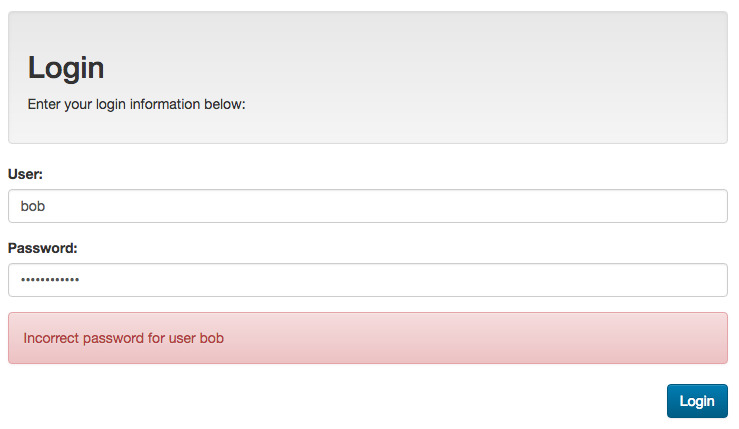
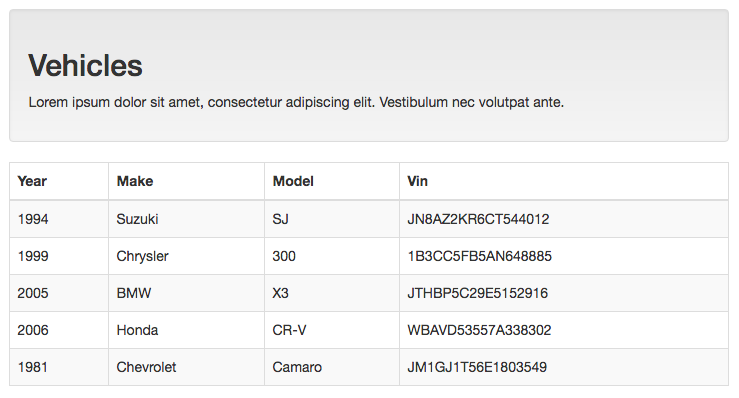

## Incorporating JWT in an Angular Application

If our Web API provides security features (register/login routes, stored user names with hashed passwords and JWT for authenticating requests), we will have to design our Angular application to work with the security mechanisms of the API.  Specifically, we will need:

* A "JWT" module to help us work with JSON Web Tokens
* An "Authentication" service to manage the authentication tasks and JWT
* A "Login" component / route
* "Route Guards" to stop the user from navigating to "protected" routes
* "Http Interceptor" to automatically attach an "Authorization" header (containing the user's JWT) to requests for data.

<br>

### Getting Started

**Note:** If you have not yet completed "[Introduction to Securing a Web API with JWT](https://sictweb.github.io/web422/notes/intro-web-api-security)", please go back and complete it now.  We will be using the secure "simple-API" as a source of data for our App.

If your "simple-API" (from "[Introduction to Securing a Web API with JWT](https://sictweb.github.io/web422/notes/intro-web-api-security)" is not currently running on port 8080, please start it up now. 

<br>

#### Obtaining &amp; Running the "simple-app"

We have provided a "starting point" in the form of a simple Angular application containing a Navbar and two routes: "Home" and "Vehicles".  This Angular application is located in the "simple-app" folder from the [Week 11 example code](https://github.com/sictweb/web422/tree/master/Code%20Examples/week11)); download it and open it in Visual Studio Code before we proceed.

You will notice that our "simpleApp" will not run as downloaded.  This is because the all-important "node_modules' folder containing all of our dependencies is missing.  To rebuild this folder and get the app running, we will need to execute the familiar `npm install` command.

With the dependencies fetched, we can now start up our app with `ng serve`.  You will see that we only have two routes (excluding the "not found" route) available to the user: "Home" and "Vehicles".  If we try to access the "Vehicles" route, we will not see any data due to a **401 - Unauthorized** error returned from our "simple-API" (this can be confirmed in the browser console). 

<br>

### Adding support for JWT (JwtModule)

If we wish to work with JWT in our Angular application, we will need to obtain the ([`@auth0/angular-jwt`](https://www.npmjs.com/package/@auth0/angular-jwt) package) - this will give us access to the "JwtModule". 

<br>

#### Step 1: Install the @auth0/angular-jwt package 

```
npm install @auth0/angular-jwt
```

<br>

#### Step 2: Import JwtModule in app.module.ts

```ts
import { JwtModule } from "@auth0/angular-jwt";
```

<br>

#### Step 3: Define a "tokenGetter" Function

Next, we must define a "tokenGetter" function, to be used in the configuration of the JwtModule.  This function will be responsible for actually obtaining the locally stored "JWT".  In our application, we will simply store the JWT in "[local storage](https://developer.mozilla.org/en-US/docs/Web/API/Window/localStorage)" using the identifier: "access_token". 

This function will be defined in **app.module.ts** just *below* all of the `import` statments, and *before* the `@NgModule` decorator:

```ts
export function tokenGetter() {
  return localStorage.getItem('access_token');
}
```

<br>

#### Step 4: Add the JwtModule to the 'imports' Array:

Finally, we will add the JwtModule to the 'imports' array using the following configuration:

```ts
  imports: [
    ...,
    JwtModule.forRoot({
      config: {
        tokenGetter: tokenGetter,
        authScheme: 'JWT'
      }
    })
  ],
```

<br>

### Building an "Authentication" Service:

Since we will be working with JWT and protected routes, it makes the most sense to have all of our "Authentication" related code in one place (ie: a "service").  This service will be responsible for:

* Fetching the token from "local storage"
* Reading the contents of the token
* Determining whether or not the user is "authenticated" - ie: does the token exist in local storage?
* Make an AJAX "POST" call using the "HttpClient" service to the "api/login" route of our server.  We will provide a "user" object as credentials

To create this service, follow along with the instructions below:

<br>

#### Step 1: Use the Angular-CLI to generate our "AuthService"

```
ng g s Auth --module app
```

<br>

#### Step 2: Add the definition for a "User" Object

In a new file called "User.ts", add the following code (below).  This will define a "User" object with the same properties as our "userSchema" (used by the simple-API users database on MongoDB Atlas).

```
export class User{
    "_id": string;
    "userName": string;
    "password": string;
    "fullName": string;
    "role": string;
    __v: 0;
}
```

<br>

#### Step 3: Update the Code in auth.service.ts

```js
import { Injectable } from '@angular/core';
import { HttpClient } from "@angular/common/http";
import { Observable } from "rxjs";
import { JwtHelperService } from '@auth0/angular-jwt';

import {User} from './User';

@Injectable({
  providedIn: 'root'
})
export class AuthService {

  constructor(
    private http: HttpClient,
    private jwtHelper: JwtHelperService
  ) { }

  public getToken(): string {
    return localStorage.getItem('access_token');
  }

  public readToken(): any{
    const token = localStorage.getItem('access_token');
    return this.jwtHelper.decodeToken(token);
  }

  isAuthenticated(): boolean {
    const token = localStorage.getItem('access_token');

    // Note: We can also use this.jwtHelper.isTokenExpired(token) 
    // to see if the token is expired

    if (token) {
      console.log('token exists');
      return true;
    } else {
      console.log('no token');
      return false;
    }
  }

  login(user: User): Observable<any> {
    // Attempt to login
    return this.http.post<any>('http://localhost:8080/api/login', user);
  }
}
```

There's a lot going on in the above code, so let's break it down *piece by piece* to understand how everything works.  To begin, all of the import statements are fairly standard:  We will be using an Observable, so we must fetch it from "rxjs".  The HTTPClient comes from "@angular/common/http" (which we will need to communicate with our simple-API) and the JwtHelperService (used to decode the contents of the JWT) comes, once again from "@auth0/angular-jwt".

After injecting our required services in the constructor, we see the following methods:

* **getToken()** The get token method simply pulls the token from "local storage".  It will return **null** if the token does not exist

* **readToken()** This method is designed to return the data from the JWT stored in "local storage".  It uses the [decodeToken()](https://www.npmjs.com/package/@auth0/angular-jwt#decodetoken) method from the JwtHelperService.

* **isAuthenticated()** The isAuthenticated() method really only checks to see if there's a token available in local storage.  If there is a token, return **true**, otherwise return **false**.  This will be used by a future "GuardAuthService" to prevent the user from accessing a specific route, if the token is unavailable.

* **login()** Finally, the login() method simply makes "POST" request to our "simple-API" (currently running on localhost), and passes it the user's credentials (defined as type "User").  These will be obtained from the below "Login" Component.

<br>

### Creating the "Login" Component / Route

Now that our "Authentication" service is complete, we can add a new "Login" component to provide an interface to the "/api/login" endpoint of our "simple-API".  If the user's login attempt was successful, we will then store the returned JWT in "[local storage](https://developer.mozilla.org/en-US/docs/Web/API/Window/localStorage)".

<br>

#### Step 1: Use the Angular-CLI to generate our "LoginComponent"

```
ng g c Login
```

<br>

#### Step 2: Adding the "LoginComponent" to the list of "Routes"

In "app.routing.module.ts", add the following route to the "Routes" array under "vehicles".   **Note:** You will have to "import" the "LoginComponent" (`import { LoginComponent } from './login/login.component';`):

```js
{ path: 'login', component: LoginComponent }
```

<br>

#### Step 3: Adding a link to "Login" in the NavComponent template

In the "navbar-collapse" &lt;div&gt;...&lt;\/div&gt;, just above "home" link, add the code:

```html
<li routerLinkActive="active"><a routerLink="login">Login</a></li>
```

<br>

#### Step 4: Updating the "LoginComponent" class:

```ts
import { Component, OnInit } from '@angular/core';
import { User } from '../User';
import { NgForm } from '@angular/forms';
import { AuthService } from '../auth.service';
import { Router } from "@angular/router"

@Component({
  selector: 'app-login',
  templateUrl: './login.component.html',
  styleUrls: ['./login.component.css']
})
export class LoginComponent implements OnInit {

  public user:User;
  public warning:string;

  constructor(private auth:AuthService, private router:Router) { }

  ngOnInit() {
    this.user = new User;
  }

  onSubmit(f: NgForm): void {

    this.auth.login(this.user).subscribe(
      (success) => {
        // store the returned token in local storage as 'access_token'
        localStorage.setItem('access_token',success.token);
        // redirect to the "vehicles" route
        this.router.navigate(['/vehicles']);
      },
      (err) => {
        this.warning = err.error.message;
      }
    );

  }
}
```

If we examine the above code, we can see that there's nothing too new happening here, with the exception of the "onSubmit()" method.  In **onSubmit()**, the **user** property (modified using the form in the component template - see below) is passed to the **login** method, which (as we have seen) will pass the data on to the "/api/login" route of our "simple-API".  If our simple-API successfully authenticates the user based on these credentials, the Observable will pass the message back (success), containing the JWT (in the "token" property).  We then take this "token" (JWT) and store it in local storage as "access_token" for later use. Additionally, we will redirect the user to the "/vehicles" route.  

If the simple-API sends an error back stating that there's an issue with the credentials, we can catch this error (err) in the 2nd "subscribe" callback and set the "warning" property of the component with the returned message.  This will provide appropriate feedback to the user in the event that they have made a mistake entering their login credentials. 

<br>

#### Step 5: Updating the "LoginComponent" template:


```html
<div class="row">
  <div class="col-md-12">
    
    <div class="well">
      <h2>Login</h2>
      <p>Enter your login information below:
    </div>

    <form #f="ngForm" (ngSubmit)="onSubmit(f)">
      <div class="form-group">
        <label class="control-label" for="name">User:</label>
        <input type="text" class="form-control" id="userName" name="userName" [(ngModel)]="user.userName" autofocus>
      </div>
      <div class="form-group">
        <label class="control-label" for="name">Password:</label>
        <input type="password" class="form-control" id="password" [(ngModel)]="user.password" name="password">
      </div>

      <div class="alert alert-danger" *ngIf="warning">
        {{warning}}
      </div>

      <button class="btn btn-primary pull-right" type="submit">Login</button>
    </form>
    
  </div>
</div>
```


Here, we have a simple form that captures the **userName** and **password** properties of the public **user** (type: "User") property in the component.  If the "warning" property is set (as we have seen from above), then the warning will be displayed to the user.

<br>

#### Step 6: Previewing / Testing the Component 

If we try to log in now, we should see everything functioning as expected: the errors show up correctly, and the user is redirected to the "/vehicles" route once correctly identified (authenticated).  



Unfortunately, even though we have stored the JWT in local storage as "access_token" (this can be verified using the Chrome dev tools under the "Application" tab) we still are not getting any **vehicle** data back from the server.  This is because we are still **not sending the JWT** with the request.  To remedy this and *automatically* send the JWT with our requests, we need to create another service:  

<br>

### Generating an "InterceptTokenService"

To automatically send our JWT (located in local storage as "access_token") using the correct "Authorization" header and scheme (ie: "JWT" + *space* + token), we need to write a special [HttpInterceptor](https://angular.io/api/common/http/HttpInterceptor) service.  For our purposes, it's just a regular service that **implements** "HttpInterceptor" (from "@angular/common/http") and has a special method called **intercept**, that performs the work.

<br>

#### Step 1: Use the Angular-CLI to generate our "InterceptTokenService"

```
ng g s InterceptToken --module app
```

<br>

#### Step 2: Updating the "InterceptTokenService" class:

* First, add the required "import" statements:

```ts
import { HttpRequest, HttpHandler, HttpEvent, HttpInterceptor } from '@angular/common/http';
import { AuthService } from './auth.service';
import { Observable } from 'rxjs';
```

* Next, update the class definition:

```ts
export class InterceptTokenService implements HttpInterceptor {

  // Initialization

  constructor(private a: AuthService) { }

  // Methods

  intercept(request: HttpRequest<any>, next: HttpHandler): Observable<HttpEvent<any>> {
    
    // Clone the existing request, and add the authorization header
    request = request.clone({
      setHeaders: {
        Authorization: `JWT ${this.a.getToken()}`
      }
    });
    // Pass the request on to the next handler
    return next.handle(request);
  }

}
```

You can see from the above code, that our ["intercept" method](https://angular.io/api/common/http/HttpInterceptor#intercept) has a very specific definition.  It's function is to "intercept" the request (available as the "request" property), perform some work on the request, and finally pass the request on to the "next" request handler (available as the "next" property).

For our purposes, this is all fairly boilerplate except for the "setHeaders" property.  This is where we identify which header we would like to set (ie: "Authorization") and what the data should be (ie: "JWT" + *space* + token).  We use the "AuthService" to pull the token from local storage.

<br>

### Adding "HTTP_INTERCEPTORS" to the "providers" Array in app.module.ts

Once our special "HttpInterceptor" service is complete, the final step is to add it to our application so that it can be applied to our HTTP requests.  This involves updating the **providers** array in **app.module.ts** using a slightly different definition (see below)

<br>

#### Step 1: Add the Correct "import" Statements to app.module.ts

```ts
import { HttpClientModule, HTTP_INTERCEPTORS } from '@angular/common/http';
```

**Note:** the above will replace the *existing* import statement for `HttpClientModule`.  

Next, add:

```ts
import { InterceptTokenService } from './intercept-token.service';
```

<br> 

#### Step 2: Add the "InterceptTokenService" to the "providers" array.

```ts
{
  provide: HTTP_INTERCEPTORS,
  useClass: InterceptTokenService,
  multi: true
}
```

You will notice that we do not add the "InterceptTokenService" directly.  Instead, it is identified in the "userClass" property of an anonymous object, added to the array of providers. The "provide" property allows us to register our "InterceptTokenService" with the [array of "HttpInterceptors"](https://angular.io/api/common/http/HTTP_INTERCEPTORS), while the "multi" property indicates that there could be more than one Interceptor.

<br>

#### Step 3: Testing the "/vehicles" Route.

If we refresh the "/vehicles" route, we should now see our list of vehicles!  This is because our "Authorization" header was correctly added to the request (thanks to our "InterceptTokenService") and the simple-API accepted our token (stored in local storage after login).



<br>

### Generating a "GuardAuthService" to "Guard" our Routes

So far, everything is running smoothly: we are able to enter user credentials that (if valid) result in a JWT that we store locally.  With every request, our application fetches the JWT and provides it to the server to prove the user's identity.  

There are only a few small usability and security concerns left.  For example, the user should not really be permitted to access the "/vehicles" route without being authenticated.  What if there were some sensitive *static* information on the "vehicles" template? Does it make sense to allow an unauthenticated user to visit a view, if they're guaranteed to not see any data? if It would be better for usability and security, if we did not enable the user to travel to that route, unless they are authenticated.  

To solve this issue, Angular has the concept of "[Route Guards](https://angular.io/guide/router#guards)".  Essentially, a "Route Guard" is a special service that implements "[CanActivate](https://angular.io/api/router/CanActivate#canactivatee)"; which specifies a "[canActivate()](hhttps://angular.io/api/router/CanActivate#methods)" method that controls access to a route by returning **true** or **false**.  We can also use this method to redirect the user to a specific route.  For example, if a user is not authenticated, we can redirect them back to the "/login" route.  

To assign a "Route Guard" to a specific route, we will add it to an existing Route definition in **app-routing.module.ts** (see below)

<br>

#### Step 1: Use the Angular-CLI to generate our "GuardAuthService

```
ng g s GuardAuth --module app
```

<br>

#### Step 2: Updating the "GuardAuthService" class:

* First, add the required "import" statements:

```ts
import { Router, CanActivate } from '@angular/router';
import { AuthService } from './auth.service';
```

* Next, update the class definition:

```ts
export class GuardAuthService implements CanActivate {

  // Initialization

  constructor(
    private auth: AuthService,
    private router: Router
  ) { }

  // Methods

  canActivate(): boolean {

    if (!this.auth.isAuthenticated()) {
      this.router.navigate(['/login']);
      return false;
    }
    return true;
  }
}
```

You will notice that the class definition is fairly boilerplate, with the exception of the "canActivate()" method.  Here, we use the AuthService "isAuthenticated()" method to determine whether or not the user is authenticated. If the user is not currently authenticated (the JWT is missing from local storage), redirect them to the "/login" route and prevent access to the route by returning **false**.  If "isAuthenticated()" returns true, grant access to the route by returning **true**.

**Note:** We can create multiple guards (ie: "GuardAuthAdminService", or "GuardAuthDataService") that work by looking for a specific "role" in the JWT.  If the user is authenticated, but their role (obtained using **this.auth.readToken()** doesn't match the required minimum, then deny access.  We can place these guards on different routes within our application (see below).

<br>

#### Step 3: Updating our "vehicles" Route with the "Guard":

As mentioned above, we must **assign** our guard to a specific route to control it's access.  In our case, we will be "guarding" the "vehicles" route.  Add the following code to the **app-routing.module.ts** file:

* First, add the required "import" statement:

```ts
import { GuardAuthService } from './guard-auth.service';
```

* Next, update the "vehicles" route using the "canActivate" property with the "Guard" service:

```ts
{ path: 'vehicles', component: VehiclesComponent, canActivate: [GuardAuthService] },
```

<br>

#### Step 4: Removing the Token and Testing the Guard:

If we test our app now, we shouldn't really notice any difference.  We can navigate from/to the "vehicles" route without a problem.  This is because our JWT is still stored in local storage as "access_token".  Since we do not have a "logout" component to remove the token using the User Interface, we will have to manually delete it.

If you're using the Chrome web browser, all of the "local storage" data can be accessed from the **Developer Tools** under the **Application** tab.  On the left sidebar, you should see "Local Storage" with an entry for `http://localhost:4200`.  Here, you will see "access_token" (simply click on the entry "Clear All" icon above to remove it).

If we refresh the route with the access token removed, you will see that the user is redirected back to the "/login" route!

<br>

### Updating the NavComponent using JWT Data

Everything is now working nicely in our application; the user must be authenticated to view the "/vehicles" route and the JWT (obtained from our LoginComponent) is correctly sent to the server to allow access to the data. There is only one small usability concern left; the NavComponent template still shows the "Vehicles" menu item, even when the user is **not** authorized to view the route.  

There are a number of ways to address this problem, however the simplest method is simply to try to "read" the token (using the "**readToken()**" method of our **AuthService**) every time the route changes (this will occur when the application is first loaded as well).  If the method returns **null** then we do not have a token and the user is not authorized to view the protected menu items.  If a token does exist, we can read the values and determine (optionally based on the "role" property), whether or not to show or hide different UI elements!

In our case, we will ensure that the NavComponent template shows the following if the user is **not** authenticated (ie: the "Home" and "Login" Links):


If the user **is** authenticated, then we will show the following (ie: the text for "Home" contains a welcome message for the user, the "Login" link is removed and finally, the "Vehicles" link is made available) 


To accomplish this, we will need to make a few small alterations to the NavComponent class &amp; template files:

<br>

#### Step 1: Add the Required "import" Statements:

```ts
import { Router, Event, NavigationStart } from '@angular/router';
import { AuthService } from '../auth.service';
```

<br>

#### Step 2: Update the Constructor and Add a "token" Property 

* To use the Router and AuthService Services, we must inject them using the constructor:

```ts
constructor(private router: Router, private auth:AuthService) { }
```

*  In the NavComponent class add a "token" property:

```ts
public token: any;
```

<br>

#### Step 3: Update the ngOnInit() Method 

```ts
ngOnInit() {
  this.router.events.subscribe((event: Event) => {
    if (event instanceof NavigationStart) { // only read the token on "NavigationStart"
      this.token = this.auth.readToken();
    }
  });
}
```

Here, we are "subscribing" to all router events.  The "event" that occurs will be one of the [many events](https://angular.io/api/router/Event) triggered in the router lifecycle, however we are only interested in attempting to read the token once the navigation "starts" (ie: "NavigationStart").  

<br>

#### Step 4: Updating the NavContainer Template: nav.component.html

* Our "Vehicles" link must be updated to the following (ie: only displays if there is a token present):

```html
<li *ngIf="token" routerLinkActive="active"><a routerLink="vehicles">Vehicles</a></li>
```

* Our "Login" link must be updated to the following (ie: only displays if there is no token present):

```html
 <li *ngIf="!(token)" routerLinkActive="active"><a routerLink="login">Login</a></li>
```

* Finally, our "Home" link needs to be updated as follows (ie: conditionally change the text "Home" to a "Welcome" message if the user is logged in:)


```html
<li routerLinkActive="active"><a routerLink="home"><span *ngIf="token">Welcome {{token.userName}}</span><span *ngIf="!(token)">Home</span></a></li>
```


