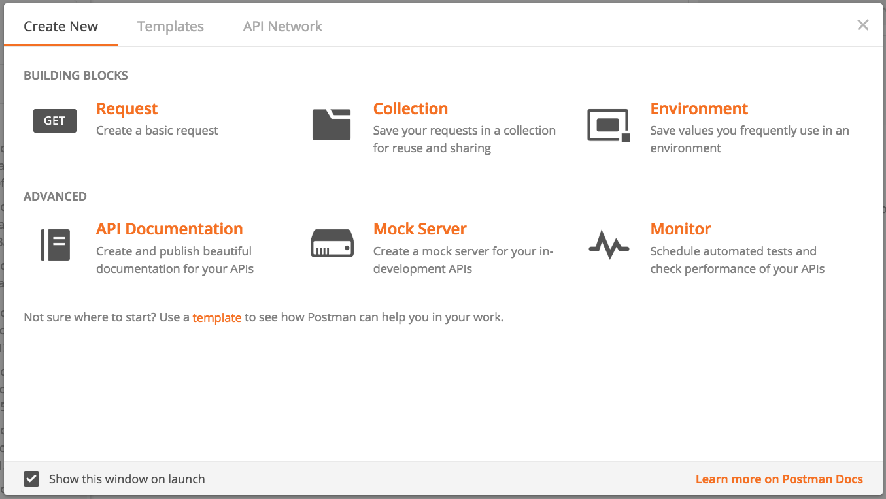
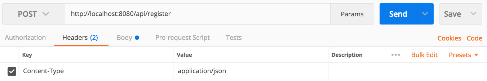
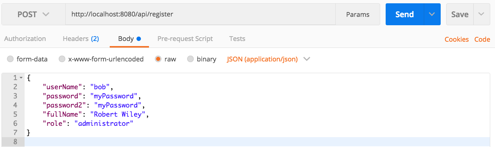
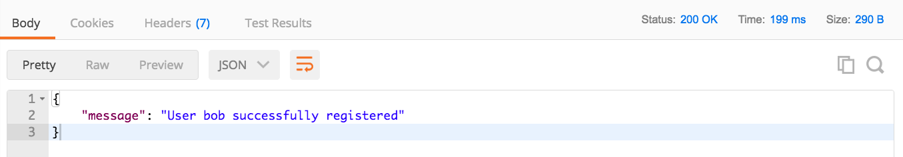
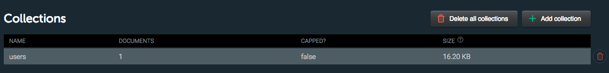
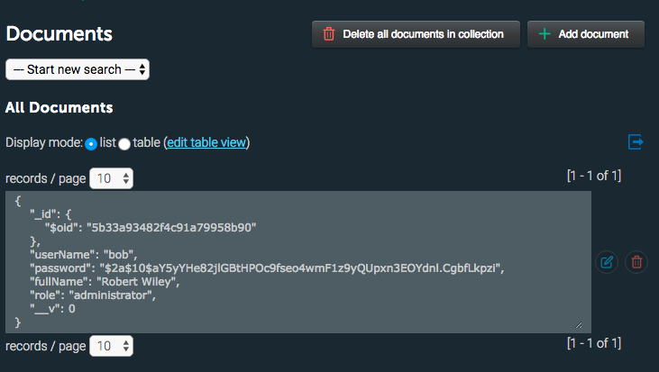
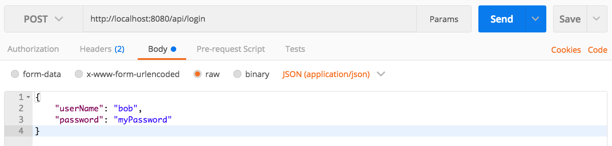

## Introduction to Securing a Web API with JWT

**Introduction paragraph here...** 

Before we can begin learning about how to secure a Web API, we will need to create a simple Node.js server to handle our API requests.  To speed this along, we have included a simple Web API in the Code Examples for this week (See the "simple-api" folder from the [Week 12 example code](https://github.com/sictweb/web422/tree/master/Code%20Examples/week12).  Currently, the primary function of this Web API is to return a hard-coded, static list of vehicles from its data-service.js module, using the route "/api/vehicles".  

Once you have grabbed the "simple-api" folder from gitHub, open it in Visual Studio and execute the command:

```
npm install
```

from the integrated terminal to fetch the dependencies (currently, only [express](https://www.npmjs.com/package/express) & [cors](https://www.npmjs.com/package/cors)).

Once this is complete, execute the command:

```
node server.js
```

to start the server and test the "/api/vehicles" route on localhost:8080.  You should see an array of JSON objects, consisting of 5 vehicles. 

<br>

### Quick note on "CORS"

At this point, you may be asking "What is 'cors' and why do we need this module?".  CORS stands for "Cross-Origin Resource Sharing" and it is essentially a way to enable JavaScript to make an AJAX call from one origin (domain) to a server on a **different** domain.  This is not permitted by default, as browsers restrict these types of requests for security reasons. If we did not enable CORS, we could not use AJAX to make requests from our localhost to our API, if our API is placed online (ie: Heroku).

The Teams API that we have used throughout this course has CORS enabled for this reason (you can see it in server.js for yourself).

In addition to simply allowing all AJAX requests from outside domains (this how our Teams API & Simple API function), the CORS module also allows you to "whitelist" certain domains, thereby allowing access for specific domains, while restricting access from all others.

More details can be found on MDN under "[Cross-Origin Resource Sharing (CORS)](https://developer.mozilla.org/en-US/docs/Web/HTTP/CORS)" and the ["cors" module on NPM](https://www.npmjs.com/package/cors)

<br>

### Review User Account Management & Security

Now that our extremely simple "vehicles" API is in place and produces data, we can discuss how we might *protect* this data from unwanted (unauthorized) access. 

Back in WEB322, we discussed a number of [security considerations](http://zenit.senecac.on.ca/~patrick.crawford/index.php/web322/course-notes/week12-class1/) that are vital to a modern web application.  This primairly included coverage of HTTPS, Certificates / Certificate Authorities and password encryption (hashing). In today's example, we will focus on bcrypt, as well as a refresher on setting up an mLab DB to store our user information & credentials.

<br>

#### mLab & MongoDB

You should be familiar with mLab from our [experience in WEB322](http://zenit.senecac.on.ca/~patrick.crawford/index.php/web322/course-notes/week8-class1/) as well as the [Teams API Setup notes](https://sictweb.github.io/web422/notes/teams-api-setup).  mLab will be responsible for hosting our separate (MongoDB) "users" database.

To set up a new "users" database for the simple API, follow along with the [Teams API Setup notes](https://sictweb.github.io/web422/notes/teams-api-setup) starting with "**MongoDB Database**" and continuing until you complete the "**Adding a new User**" step.  **Note:** Instead of naming your collection "teams-api-db", name it "simple-api-users" to keep everything separate and clear.

Be sure to keep track of your connection string, as we will be using it in the next piece:

#### Updating the "user-service"

To keep our DB authentication piece clean, we will be making use of the promise-based "userService" module, defined in the   "user-service.js" file.  If you open this file, you will see a space for your MongoDB connection string - enter it now before proceeding.

Next, you will notice a definition for a "user" Schema (userSchema).  In this case, it consists of 4 simple fields:

* **userName:** <br>A (unique) string representing the user's login/user name<br><br> 
* **password:** <br>The user's password<br><br>
* **fullName:** <br>Ths user's full name<br><br>
* **role:** <br>The user's role, ie "administrator", "data-entry", "maintenance", etc. (the user's role will define exactly what in the API the user has access to.  For our example we will not be using this field, as every user will have access to all vehicles)

Below this, you should note that there are 3 exported functions:
* **connect():** <br>This function simply ensures that we can connect to the DB and if successful, assign the "User" object as a "User" model, using the "users" collection (specified by userSchema).<br><br>
* **registerUser(userData):** <br>Ensures that the provided passwords match and that the user name is not already taken.  If the userData provided meets this criteria, add the user to the system.<br><br> 
* **checkUser(userData):** <br>This function ensures that the user specified by "userData" is in the system and has the correct password (used for logging in)

Lastly, before we can move on to test the application (below) we must update our "server.js" to "connect" to our user service before we start the server, ie:

```
userService.connect().then(()=>{
    app.listen(HTTP_PORT, ()=>{console.log("API listening on: " + HTTP_PORT)});
})
.catch((err)=>{
    console.log("unable to start the server: " + err);
    process.exit();
});
```

<br>

#### Hashed Passwords with bcrypt (bcryptjs)

Up to this point, our user service has been designed to store passwords as plain text.  This is a serious security concern as passwords must **always** be encrypted.  In WEB322, we learned how to accomplish this using bcrypt.

Recall: To include bcrypt, we must install bcryptjs it using **npm** and "require" the module at the top of our user-service.js:

```
const bcrypt = require('bcryptjs');
```

Once we have the module, we can use the following logic to **hash** a password using bcrypt's **genSalt()** and **hash()** methods, ie:

```javascript
// Encrypt the plain text: "myPassword123"
bcrypt.genSalt(10, function(err, salt) { // Generate a "salt" using 10 rounds
    bcrypt.hash("myPassword123", salt, function(err, hash) { // encrypt the password: "myPassword123"
        // TODO: Store the resulting "hash" value in the DB
    });
});

```

If we apply this process to our "registerUser" function (thereby *hashing* the provided password when registering the user), our code will look like this:

```javascript
module.exports.registerUser =  function (userData) {
    return new Promise(function (resolve, reject) {

        if (userData.password != userData.password2) {
            reject("Passwords do not match");
        } else {

            // Generate a "salt" using 10 rounds
            bcrypt.genSalt(10, function (err, salt) {
                if (err) {
                    reject("There was an error encrypting the password");
                } else {

                    // Encrypt the password: userData.password
                    bcrypt.hash(userData.password, salt, function (err, hash) {

                        if (err) {
                            reject("There was an error encrypting the password");
                        } else {

                            userData.password = hash;

                            let newUser = new User(userData);

                            newUser.save((err) => {
                                if (err) {
                                    if (err.code == 11000) {
                                        reject("User Name already taken");
                                    } else {
                                        reject("There was an error creating the user: " + err);
                                    }

                                } else {
                                    resolve("User " + userData.userName + " successfully registered");
                                }
                            });
                        }
                    });
                }
            });
        }
    });
};
```

This makes the code a little longer and harder to follow, but we are really only adding the **bcrypt.genSalt()** & **bcrypt.hash()** methods to our existing function.

If we wish to **compare** a plain text password to a **hashed** password, we can use bcrypt's **compare()** method with the following logic:

```javascript
// Pull the password "hash" value from the DB and compare it to "myPassword123" (match)
bcrypt.compare("myPassword123", hash).then((res) => {
   // if res === true, the passwords match
});
```

If we apply this to our "checkUser" function (thereby comparing the DB's *hashed* password with the provided password), our code will look like this:

```javascript
module.exports.checkUser = function (userData) {
    return new Promise(function (resolve, reject) {

        User.find({ userName: userData.userName })
            .limit(1)
            .exec()
            .then((users) => {

                if (users.length == 0) {
                    reject("Unable to find user " + userData.userName);
                } else {
                    bcrypt.compare(userData.password, users[0].password).then((res) => {
                        if (res === true) {
                            resolve(users[0]);
                        } else {
                            reject("Incorrect password for user " + userData.userName);
                        }
                    });
                }
            }).catch((err) => {
                reject("Unable to find user " + userData.userName);
            });
    });
};
```

Not much has changed here.  Instead of simply comaring userData.password with users[0].password directly, we use the **bcrypt.compare()** method.

<br>

#### Adding & Testing Authentication Routes

Now that we have a working "user" service that will handle registering and validating user information, we should add some new "/api/" authentication routes to add the functionality to our API.  **NOTE:** Since we do not have a UI to gather user information for registration and validation, we must make use of an API testing application such as [**Postman**](https://www.getpostman.com/) (installed on the lab machines) to provide POST data to our new routes.

Since our new routes will be accepting input (via JSON, posted to the route), we will need the "body-parser" module.  

Install the module using npm and "require" it near the top of your server.js file:

```javascript
const bodyParser = require('body-parser');
```

Next, we must configure body-parser to parse "JSON" formatted data.  As you will recall from WEB322, this can be accomplished by adding the line:

```javascript
app.use(bodyParser.json());
```

With the body-parser module correctly installed and configured, we can reliably assume that the "body" property of the request (req) will contain the properties and values of the data sent from the AJAX request.

<br>

**New Route: /api/register**

This route simply collects user registration information sent using POST to the API in the form of a JSON-formatted string, ie: 

```json
{
    "userName": "bob",
    "password": "myPassword",
    "password2": "myPassword",
    "fullName": "Robert Wiley",
    "role": "administrator"
}
```

Fortunately, our **userService.registerUser()** function is perfectly set up to handle this type of data.  It will validate whether password & password2 match and check that the user name "bob" is not taken.  If the data meets these requirements, the provided password will be hashed and the user will be entered into the system.  Therefore, our new /api/register route is very simple; it must simply pass the posted data to the userService for processing and report back when it has completed, ie:

```javascript
app.post("api/register", (req, res) => {
    userService.registerUser(req.body)
        .then((msg) => {
            res.json({ "message": msg });
        }).catch((msg) => {
            res.status(422).json({ "message": msg });
        });
});
```

**NOTE:** The 422 error code communicates back to the client that the server understands the content type of the request  and the syntax is correct but was unable to process the data ([https://httpstatuses.com/422](https://httpstatuses.com/422)).

To test this new route, stop and start your API (server.js) again and open your trusty **Postman** app.  You can dismiss the initial dialog box:



And proceed to enter the following data:

* Make sure **POST** is selected in the request type dropdown
* In the address bar, type: "http://localhost:8080/api/register"
* In the **Headers** tab, ensure that "Content-Type" is selected with a value of "application/json"
* In the **Body** tab, ensure that "raw" is selected and copy and paste our information for user "bob" in the provided text area:

```json
{
    "userName": "bob",
    "password": "myPassword",
    "password2": "myPassword",
    "fullName": "Robert Wiley",
    "role": "administrator"
}
```

If you entered the data correctly, postman should look like the below:

**"Headers" Tab**<br>



**"Body" Tab**<br>



When you're sure you've entered everything correctly and your server is running, hit the large blue **SEND** button to send the POST data to the API.

Once the request is processed, it should return with a status 200 and the JSON: 

```json
{
    "message": "User bob successfully registered"
}
```
You can see this in Postman by scrolling down and selecting "body" in the response section:



You can also confirm that the user was added by clicking on the "users" collection in mLab:



This will show all of the documents in the collection, including our new "bob" user: 



<br>

**New Route: /api/login**

In addition to **adding** users to the system, we must also be able to **authenticate** users and allow them to "login" before being granted access to the data.  In this case, all of the work required for authenticating user data is done in the "dataAuth.checkUser()" method.  So (like "/api/register"), our "/api/login" route, we once again pass the posted data to the userService for processing and report back when it has completed, ie: 

```javascript
app.post("api/login", (req, res) => {
    userService.checkUser(req.body)
        .then((user) => {
            res.json({ "message": "login successful" });
        }).catch((msg) => {
            res.status(422).json({ "message": msg });
        });
});
```

To test this new route, once again stop and start your API (server.js) and open your trusty **Postman** app.  We will keep most of the values the same, with the following exceptions:

* In the address bar, type: "http://localhost:8080/api/login"
* In the **Body** tab, ensure that "raw" is selected and copy and paste our information for user "bob" in the provided text area:

```json
{
    "userName": "bob",
    "password": "myPassword"
}
```

If you entered the data correctly, postman should look like the below:




Again, when you're sure you've entered everything correctly and your server is running, hit the large blue **SEND** button to send the POST data to the API.

Once the request is processed, it should return with a status 200 and the JSON: 

```json
{
    "message": "login successful"
}
```
You can see this in Postman by scrolling down and selecting "body" in the response section:


You can also try entering incorrect credentials in the request body (ie: a different "userName", or an incorrect "password") to validate that our service is indeed functioning properly and will not send the "login successful" message to unauthorized users. 

<br>

### Introduction to JSON Web Tokens (JWT)

With our new authentication routes tested and working correctly, we can now concentrate on leveraging this logic to actually **secure** the vehicle data in our simple API.  Currently, the /api/vehicles route is available to anyone, regardless of whether they've been authenticated or not.  You can see this by executing a POST request to "/api/login" route from Postman with an incorrect password for "bob", followed by GET request for "/api/vehicles".  The fact that we did not provide correct credentials during the "login" phase, had no affect on whether or not we can access the data on the "/api/vehicles" route.  

So, how can we solve this problem?  In WEB322, we would send a [cookie](http://zenit.senecac.on.ca/~patrick.crawford/index.php/web322/course-notes/week10-class1/) back to the client, once they're logged in, to be used for subsequent requests. Unfortunately, we cannot rely on cookies to solve this problem, as we cannot guarantee that the client accessing the data is a web browser.  Our API simply takes individual JSON-formatted requests, sent over HTTP and returns JSON-formatted responses.  

Instead, what we need is some kind of secure "logged in" identifier that we can **send** back to the client that can then be stored and used for subsequent requests.  The philosophy is similar, however we will not rely on cookies or make any assumptions about how the client will store this identifier.  

The client must then send the identifier as part of each request and the server will have to know that it originally sent the identifier and it has not been tampered with.  

**JSON Web Token (JWT) to the rescue**

JSON Web Tokens (JWT) are the answer to this problem:

> JSON Web Token (JWT) is an open standard (RFC 7519) that defines a compact and self-contained way for securely transmitting information between parties as a JSON object. This information can be verified and trusted because it is digitally signed. JWTs can be signed using a secret (with the HMAC algorithm) or a public/private key pair using RSA or ECDSA.<br><br>([https://jwt.io/introduction/](https://jwt.io/introduction/))

This is perfect for our purposes.  We can generate a JWT on the server (only) once the user has been **successfully authenticated** and send it back to the client along with the "login successful" message.  It will contain digitally-signed information about the authenticated user such as their "userName", "fullName" & "role" (but **never** their password).  The client can then read this information and **send the JWT back to the server** in the body of every subsequent request to be verified on the server. Since it is digitally signed on the server using a "secret", we can verify that the data has not been tampered with and that the JWT did indeed come from our simple API server.

> **When should you use JSON Web Tokens?**<br>Here are some scenarios where JSON Web Tokens are useful:<br><br>**Authorization:** This is the most common scenario for using JWT. Once the user is logged in, each subsequent request will include the JWT, allowing the user to access routes, services, and resources that are permitted with that token. Single Sign On is a feature that widely uses JWT nowadays, because of its small overhead and its ability to be easily used across different domains.<br><br>**Information Exchange:** JSON Web Tokens are a good way of securely transmitting information between parties. Because JWTs can be signed—for example, using public/private key pairs—you can be sure the senders are who they say they are. Additionally, as the signature is calculated using the header and the payload, you can also verify that the content hasn't been tampered with.<br><br>([https://jwt.io/introduction/](https://jwt.io/introduction/))

For more information about JWT, including the signature &amp; structure of the payload, see the excellent documentation at [https://jwt.io/introduction/](https://jwt.io/introduction/)

<br>

### Securing routes 

* Passport.js
* Passport-jwt

<br>

